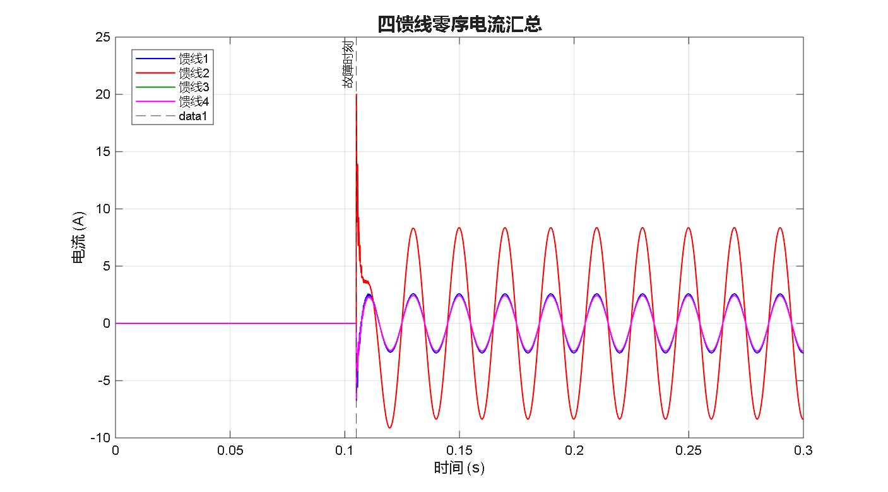
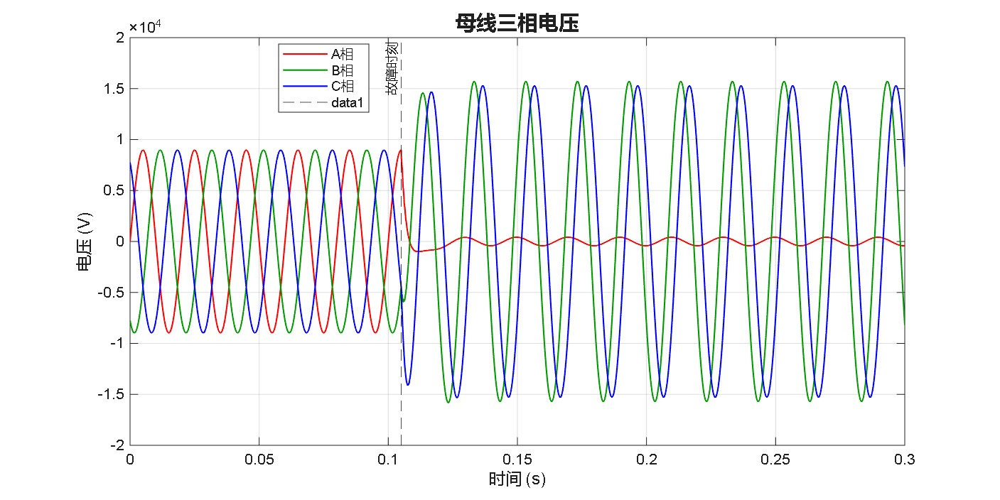
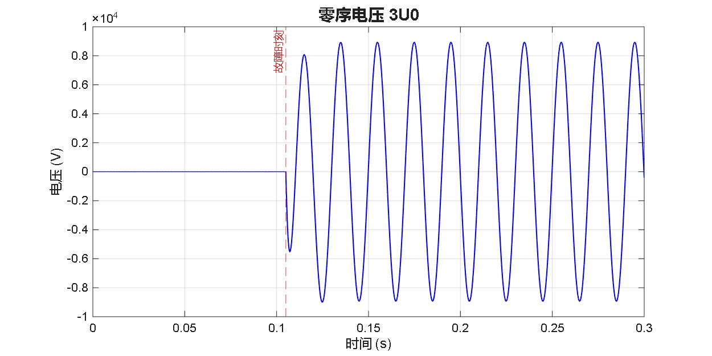
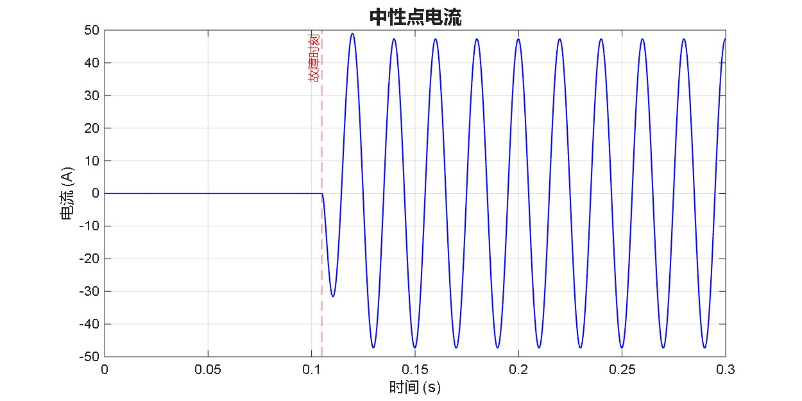

  <h1>⚡ 配电网单相接地故障选线分析 (MATLAB/Simulink) ⚡</h1>
  
<b>电气工程极其自动化专业 本科毕业设计/课程设计 仿真作品集</b>

  
  

    
    
    
 
 
  

### 1. 系统级建模与仿真
* **中压电网构建：** 基于 **MATLAB/Simulink** 独立自下而上地搭建了完整的中低压配电网模型 (`Distribution_Fault_Model.slx`)。
* **接地方式配置：** 精确模拟了各种**中性点接地方式**（包含不接地系统、以及经消弧线圈接地系统），以剖析系统在不同运行工况下的动态响应与电气行为。

### 2. 故障机理与过电压分析
* **波形特征分析：** 深入剖析了发生单相接地故障 (SPG, Single-Phase-to-Ground) 期间的**零序电流与零序电压波形**。
* **绝缘影响研究：** 掌握了非对称故障条件下**暂态过电压的演变演变逻辑**，并严格评估了过电压对**变压器**等核心电力设备绝缘耐受能力的实际物理冲击。

### 3. 算法推导与判据验证
* **特征提取：** 专注于提取暂态和稳态故障特征，以评估多种**馈线选线判据**（比幅法、比相法、五次谐波法等）的选线灵敏度与抗干扰可靠性。
* **工程严谨性：** 构建了一套逻辑严密的闭环框架，用于排查并解决电力系统中的复杂工程技术挑战。

---

## 🧠 核心选线算法实现 (Algorithms)

当前源码工程 (`Algorithms/` 文件夹) 已实现了 **三种** 不同原理的经典稳态/谐波选线算法，可一键挂载仿真模型自动计算出故障馈线：

| 算法名称 | 原理类别 | 判据核心逻辑 | 适用场景 | 源代码路径 |
|:---|:---:|:---|:---:|:---:|
| **零序电流比幅法** | 稳态幅值 | 各馈线零序电流有效值 (RMS) **最大者**即为故障线路 | 中性点不接地系统 | [`Amplitude_Compare.m`](./Algorithms/Amplitude_Compare.m) |
| **零序电流比相法** | 稳态相位 | 零序电流滞后零序电压约 90° 者为故障线 (通过 FFT 提取基波角度) | 不接地 / 补偿系统 (有理论误差) | [`Phase_Compare.m`](./Algorithms/Phase_Compare.m) |
| **五次谐波法 (推荐)** | 谐波分析 | 提取 250Hz FFT 频点，**五次谐波幅值最大者**为故障线，完美利用消弧线圈无法补偿高次谐波的物理特性 | 经消弧线圈小电流接地系统 | [`Fifth_Harmonic.m`](./Algorithms/Fifth_Harmonic.m) |
| **暂态极性法** | 暂态特征 | 利用故障发生最初的暂态零序电流首半波极性，故障线与健全线极性相反 | 不接地 / 补偿系统 (普适性强) | [`Transient_Polarity.m`](./Algorithms/Transient_Polarity.m) |

---

## 📊 核心仿真波形成果展示 (Waveform Showcases)

通过运行主控模型脚本输出的各种监测波形（所有图例保存在 `Waveforms/` 目录下）：

  
  
<b>图 1. 单相接地故障发生时（t=0.105s），四条馈线暂态及稳态零序电流的阶跃响应对比 （可见故障馈线幅值激增且相位发生翻转）</b>

 

  
  
<b>图 2. 母线三相电压波形 （A 相发生单相接地故障，A 相电压瞬间跌落至 0V，B/C 健康相电压迅速爬升至线电压级别）</b>

 

<b>👉 点击开合：查看更多细分物理量波形展示：</b>

 

  

    
    
<b>图 3. 零序电压 3U0 阶跃波形</b>

  

  

    
    
<b>图 4. 补偿系统下的中性点电感电流</b>

  

